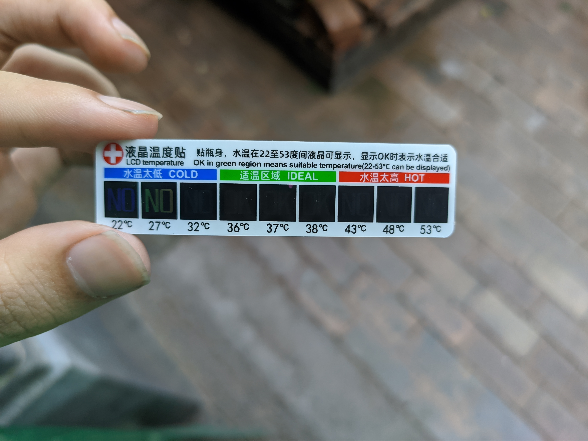
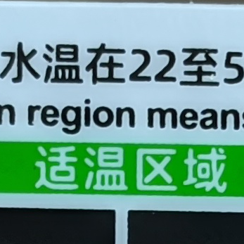
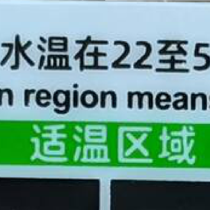
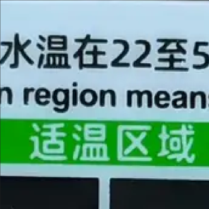

## 代码

Python脚本代码已经实现：

- [Github](https://github.com/HaujetZhao/my-photo-storage-backup-scheme)
- [Gitee](https://gitee.com/Haujet/my-photo-storage-backup-scheme)

第一次运行前先编辑脚本，修改其中的主库位置、随库位置，保存。

此后要更新随库时，只要双击运行脚本即可。

运行结果示例：

```
主库位置：D:\Users\Haujet\Camera
随库位置：D:\Users\Haujet\Camera-small

正在统计文件中……

主库中共有 23 个文件
    有 18 个图片，其中有 2 个需要压缩到随库副本
    有 4 个视频，其中有 2 个需要压缩到随库副本
    有 1 个其它文件

随库中目前共有 19 个文件
    有 16 个图片，其中有 0 个冗余图片
    有 2 个视频，其中有 0 个冗余视频
    有 1 个其它文件

遍历文件耗时  0.00s，检测视频完整性耗时  0.00s

开始压缩图片到随库，总共有 2 个图片需要压缩

    正在压缩第 1 张图片（共 2 张）：
        原文件路径 主库\folder2\IMG_20171108_170013.jpg
        原始大小 5.59MB
        宽高比 0.75，为正常比例图片
        新文件路径 随库\folder2\IMG_20171108_170013.webp
        压缩后大小 578.39KB
        比原来减小 89.90%

    正在压缩第 2 张图片（共 2 张）：
        原文件路径 主库\folder2\IMG_20171108_170356.jpg
        原始大小 2.93MB
        宽高比 1.33，为正常比例图片
        新文件路径 随库\folder2\IMG_20171108_170356.webp
        压缩后大小 210.87KB
        比原来减小 92.97%

开始压缩视频到随库，总共有 2 个视频需要压缩

    正在压缩第 1 个视频（共 2 个）：
        原视频路径  主库\folder2\新建文件夹 (2)\VID_20180821_204216.mp4
        原始大小   32.49MB
        视频时长   0.3min
        视频编码   h264
        视频比特率 13.33Mbps
        视频分辨率 1280x720
        视频帧率   30/1
        新分辨率   -2:480
frame=  578 fps=174 q=-1.0 Lsize=    1923kB time=00:00:19.16 bitrate= 822.0kbits/s speed=5.78x
        新比特率   0.78Mbps
        压缩后大小 1.88MB
        比原来减小 94.22%

    正在压缩第 2 个视频（共 2 个）：
        原视频路径  主库\folder2\新建文件夹 (2)\VID_20180826_145240.mp4
        原始大小   8.38MB
        视频时长   0.1min
        视频编码   h264
        视频比特率 13.33Mbps
        视频分辨率 720x1280
        视频帧率   25/1
        新分辨率   480:-2
frame=  120 fps=0.0 q=-1.0 Lsize=     505kB time=00:00:04.84 bitrate= 854.1kbits/s dup=1 drop=0 speed=6.42x
        新比特率   0.69Mbps
        压缩后大小 504.90KB
        比原来减小 94.11%

视频压缩任务执行完毕

随库中没有需要删除的冗余媒体文件

全部任务执行完毕，回车结束
```

## 起因

现代人都用手机拍不少照片、视频，往往一个照片 2MB、拍一段 1080p 的视频 1 分钟 150MB，非常占用空间。

但事实上，许多照片、视频用不着使用极高的画质、极高的分辨率来存储，长期占用宝贵的手机空间。

例如某些照片不太重要， 200KB 的大小、清晰度，就足以记录用户想要保存的画面信息了，但实际的照片非常高清，体积有 2MB，那这张照片就造成 10 倍的存储浪费了。（本来 1GB 的空间能存储 5000 张这样的图片，现在只能存 500 张）

许多人，手机上的照片、视频，就占用了上百 GB 空间，其中大部分的空间是被超需求的高清存储浪费了的。大部分照片占用着与其内容价值不对等的存储空间，用户也不敢肆意删除，被迫在购买新设备时候不断增加存储空间（512G、1T）

与电脑硬盘的低成本不同，移动端受物理限制，平均每增加 1GB 的价格都要贵很多。

我猜不少人因为手机存储焦虑，对手机拍照、拍视频非常克制。

如果一个用户，平均一天拍 10 张照片、1 分钟视频，一张照片 2M、1 分钟视频 120MB，一年就是 3650 张照片、365 段视频，7GB + 43GB。如果只在手机上保存这些相机直出的照片、视频，存储肯定吃不消，用户就要面临选择：删还是不删，删那些。

这种隐形的存储空间绑架，这对于厂商是有利的，这样可以迫使消费者花更多的钱，购买更大的云存储空间、更高存储规格的手机。但对消费者不利。

## 照片存储的背景知识

手机相机直出的 **原图**，也是 **经过压缩** 的，一般都使用 jpg 格式压缩，以 1200w 像素的原图为例，分辨率为 4000 x 3000，其：

- 以 **高质量** 保存，实际是以 **98%** 质量压缩，一张图平均 **5MB**
- 以 **标准质量** 保存，实际是以 **87%** 质量压缩，一张图平均 **2MB**
- 以 **低质量** 保存，实际是以 **67%** 质量压缩，一张图平均 **1MB**

所有手机默认用 **标准质量** 保存，即：**jpg** 以 **87%** 质量有损压缩。

手机厂商不会告诉你压缩的具体参数，因为没有意义，反倒是有些人会对压缩看作洪水猛兽、谈之色变。

讲这些，就是要说：

- 你以为手机中的 2MB 每张的原图，实际上也是压缩图，压缩质量为 87%
- 不要盲目地追求原图，其实原图、压缩图放你眼前，不放大到 300%，你也不一定能感知出来
- 适当的压缩，可以让感知画质不变，同时极大降低照片体积

同时：

- 不要盲目追求高像素，听见低像素就嗤之以鼻
  - 1200w 像素 分辨率为 4000 x 3000，
  - 300w 像素 分辨率为 2000 x 1500
- 将一张 1200w 像素的图片、与300w 像素的图片，放到 1080p 显示器上做壁纸，显示效果没有丝毫差异。

造成我们对压缩画质不堪直视的原因其实是：微博、空间等网络服务商，为了节约成本、加快浏览速度，将我们原本高清的图片，过分地压缩，压缩到了只有几十 KB，才导致画质相当地差。


## 照片压缩格式的背景知识

最常见的无损照片格式是 bmp，无损存储照片，一张 1200w 像素的照片，要占用 34MB。

我们最常见到的照片格式是 jpg，它是一种有损压缩格式，推出年代较早（**1992**年发布），87% 质量压缩的 1200w 像素 照片占用 2MB 左右，支持元数据。它的缺点是，细节上会出现毛边问题。

jp2 即 jpeg2000，是 jpg 格式的升级版，但由于 **版权费用贵** 的问题，没有推广开来。

webp 是谷歌于 **2010** 年推出的格式，基于 vp8 视频编码发展而来，相比于 jpg，可以用一半的体积提供更好的画质，即 **压缩比大大提高**，没有 jpg 的毛边问题，支持 **元数据**，支持动图，**开源、免专利费**，在各大互联网公司得到了大力推广，对提高图片加载速度、节省带宽起到了重要作用，各大浏览器、图片浏览器已全面支持。它的缺点是编码时间比 jpg 要长、Photoshop 暂不支持直接编辑。

heif 是 MPEG 于 **2015** 年推出的格式，基于 h265 视频编码发展而来，据宣传压缩率比 jpg 高很多。但由于 h265 收专利费，heif 也 **收专利费**，推广很是吃力，兼容性差，现在只有安卓和 iOS 上加入了支持，苹果现在就以 heif 作为默认照片格式。

综上，由于 

- jpg 格式太老，有毛边，画质效果差
- webp 格式新，画质更好，支持元数据，压缩效果是 jpg 2倍，开源、免费、得到广泛推广，兼容性不错
- heif 收专利费，推广差、各平台兼容差

目前来看，选用 webp 作为压缩图片，优点最高。


## 备份方案

总述：

- 手机上的相册，通过 Synchting 同步到电脑 **主库**。
	- 手机端同步设置为 **只发送**
	- 电脑端同步设置为 **只接收**
- 电脑端将主库的图片、视频，通过脚本，压缩副本到一个 **随库** 
- 将电脑端的 **随库** ，也通过 Syncthing 同步到手机上


工作流解释：

- 手机上使用相机拍照，照片、视频原图会存储在相册文件夹
- 相册文件夹的图片会同步到电脑 **主库**
- 在电脑端，通过脚本，将主库中新增的图片，压缩副本到 **随库** 
- **随库** 中新增的压缩图片，就会同步到手机 **随库** 上


达成目的：

- 手机相册只是充当了一个临时站，其中存放的几天前的的大体积 **原图**、**原视频** 可以随时删除，去除对手机存储的压力，因为
  - 原图已经同步到了 **电脑端主库** 
  - 并在 **随库** 生成了压缩版本，同步到了 **手机端随库**
- 电脑端的 **主库** 可以保存数十年的原图、原视频
  - 充分发挥了电脑端存储成本低的优点
  - 可以自由地进行编辑、剪辑、创作
  - 可以自由、方便地进行二次备份
- **随库** 可以 **用先进的压缩格式** 、**以相当不错的画质** 保存数十年的图片、视频，同时 **体积相当小巧**，对手机 **几乎没有存储压力**，可以在手机上方便地查看数十年所有的照片。


用到的批处理命令行工具：

- ImageMagick，用于获取图片信息、转换和压缩图片
- FFmpeg，用于压制视频
- FFprobe，用于获取视频信息

## 为什么要将原图放在电脑端，而不使用云盘？

总的原因是：数据自由。

有人认为将原图、原视频放在电脑，与放在网盘的区别不大，优势不足，这是没有想明白这个设想与网盘的区别。

设想一下，一个人一年拍50g的照片视频，128g手机里最多保存1年的东西。采用压缩方案，可以保存10年的照片视频，且有相似的本地体验。

使用网盘，有以下缺点：

- 首先10年的照片有好几百 GB，云盘成本高，谁也无法保障你的云盘服务商：
  - 真的能把你的数据完好地保存十年，不会说：
    - 照片视频违规，已删除
    - 不好意思，资源不存在
  - 快倒闭的时候给你充足的时间、带宽用于下载、转移你的珍贵数据
  - 真的能数十年不倒闭
- 其次，从网盘查看照片与视频，体验极差（在网盘上浏览过上万张图片的文件夹自然明白）
- 最后，很多人并不愿意将照片视频直接放到网盘上，因为隐私与安全性无法满足要求

当用户有珍贵的数据时，会认真对待这些数据的、最可靠的，只有用户自己。

将原图、原视频放在电脑端，则有以下优势：

- 可以方便地在电脑上整理
- 方便进行永久存档、多重备份、加密上传网盘备份
- 满足对高度隐私、保密的需求
- 满足使用原始高质量素材进行剪辑、编辑创作的需求

总之，把原始文件放在本地，等于一切形式的数据自由。


## 压缩后的存储成本计算

### 图片

以 1200w 像素手机为例，我进行了一些压缩测试：

- 原图，1200w 像素，分辨率 4000x3000，jpg 格式，87% 质量，平均大小 2.0MB
- 压缩图，675w 像素，分辨率 3000x2250，webp 格式，70% 质量，平均大小 300KB
- 压缩图，300w 像素，分辨率 2000x1500，webp 格式，70% 质量，平均大小 150KB
- 另外加入 jpg 压缩对比下：
  - 压缩图，300w 像素，分辨率 2000x1500，jpg 格式，70% 质量，平均大小 250KB

在实际体验下，300w 像素的图片，观感上并不会有明显的下降。

如果一个用户，平均一天拍 20 张照片，拍 10 年，那就是 20 * 365 * 10 = 73000 张照片，再进行计算：

- 原图，1200w 像素，分辨率 4000x3000，jpg 格式，87% 质量，总大小约 146GB
- 压缩图，675w 像素，分辨率 3000x2250，webp 格式，70% 质量，总大小约 21.9GB
- 压缩图，300w 像素，分辨率 2000x1500，webp 格式，70% 质量，总大小约 10.95GB

### 视频

然后，再进行视频压缩测试：

- 原视频，1080P 60fps，分辨率 1920x1080，h264 编码，码率 20Mbps，1分钟 150MB
- 精压视频，1080P 60fps，分辨率 1920x1080，h264 编码，画质参数 crf23，平均码率 6Mbps，1分钟 45MB
- 压缩视频，480P 60fps，分辨率 720x480，h264 编码，画质参数 crf23，平均码率 1.2Mbps，1分钟 9MB
- 压缩视频，360P 60fps，分辨率 480x360，h264 编码，画质参数 crf23，平均码率 0.8Mbps，1分钟 6MB

如果一个用户，平均一天拍 2min 视频，拍 10 年，那就是 2 * 365 * 10 = 7300 分钟视频，再进行计算：

- 原视频，1080P 60fps，分辨率 1920x1080，h264 编码，码率 20Mbps，总大小约 **1095GB**
- 精压视频，1080P 60fps，分辨率 1920x1080，h264 编码，画质参数 crf23，平均码率 6Mbps，总大小约 **328GB**
- 压缩视频，480P 60fps，分辨率 720x480，h264 编码，画质参数 crf23，平均码率 1.2Mbps，总大小约 **65.7GB**
- 压缩视频，360P 60fps，分辨率 480x360，h264 编码，画质参数 crf23，平均码率 0.8Mbps，总大小约 **43.8GB**

为综合画质、流畅度、体积，建议使用 480P 60fps 作为移动端存储的压缩视频参数，即便是每天拍 2min，10 年的视频也只有 66GB。

> 不要因为数字小看 480P，在微博上你能刷到的视频，观看时都是 480P，已经是属于够用的分辨率，再加上 60fps，观看体验不容小觑。

使用 H264 是因为现在的 H265 编码要比 H264 慢 2 - 3 倍，不太值得使用。如果以后 h265 更流行、设备算力更高，使用 h265 作为视频编码，视频存储的体积还能再下降一半。

### 总结

显然，一个压缩后的 **随库**，能在移动设备上轻松存储用户数十年的照片、视频回忆，显著减轻移动设备的存储压力。

使用这种方案，能有效降低用户在拍视频、照片时因移动设备存储空间焦虑而带来的胆怯。

## 照片压缩后的实际效果对比

这是原图，谷歌相机抓拍，1200w 像素，分辨率 4000x3000，质量 95%，大小 1.82MB：



因压缩后整体观感无二致，因此不再对比。

此处，对以下三项进行细节放大比较：

1. 原图，1200w 像素，分辨率 4000x3000，质量 95%，大小 1.82MB
2. jpg 压缩，300w 像素，分辨率 2000x1500，质量 70%，大小 165KB
3. webp 压缩，300w 像素，分辨率 2000x1500，质量 70%，大小 93KB








可以看出，第二张的 **jpg 压缩版本** 出现了毛边效应，细节上非常影响观感，而第三张的 **webp 压缩版本** 不仅体积更小，还没有毛边效应，细节可喜，分辨率从 1200w 降到 300w，仍能非常好的保留有效画面信息，性价比相当高。
